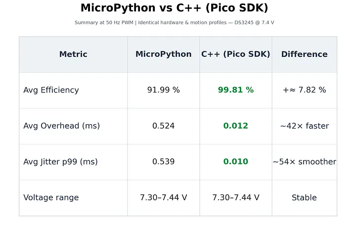

Master PI (Rpi pi pico w) communicates with slave pies (pi pico's). To even further complicate this project, we are using i2c to synchronize multiple slave processors and batch compute game positions. Now this enables us to run Micropython on Pico W and C++ on pies, both over-engineering and possibly making computing faster. 

## C++ vs Micropython 

[source](https://medium.com/@okannamdar/c-vs-micropython-measuring-real-time-precision-in-a-low-latency-tracking-system-e23fbb2f905d)
